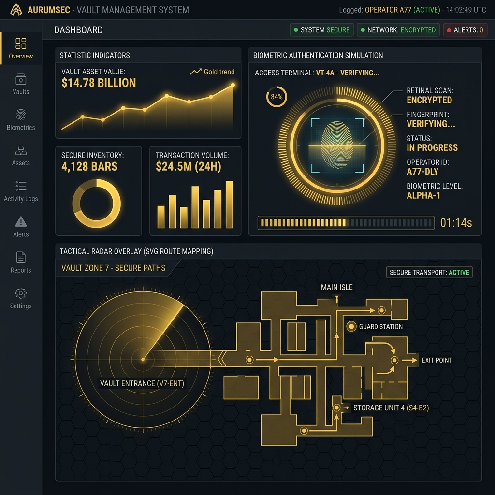

# BullionVault — High-Security Gold Vault Operations Console

An enterprise-grade, high-security gold vault management console featuring a premium dark luxury aesthetic, glassmorphism UI panels, neon typography accents, and custom interactive data visualizations.



## 🌟 Project Overview

BullionVault is a React-based security headquarters application engineered to manage and inspect gold storage reserves, monitor perimeter access, schedule transit operations, verify customs documents, and optimize shelf load distribution. The system utilizes HSL-tailored dark tones combined with gold-metallic highlights to simulate a highly secure vault control deck.

---

## 🛠️ Technology Stack

- **Framework**: [React 19](https://react.dev/) (Hooks-driven functional component architectures)
- **Bundler**: [Vite](https://vite.dev/) (Fast bundling and hot module replacement)
- **Styles**: **Vanilla CSS** (Custom HSL typography tokens, responsive grids, keyframed biometric sweeps, pulsing laser vectors, and blur-based glassmorphism panels)
- **Icons**: [Lucide React](https://lucide-dev.github.io/lucide-react/) (High-security iconography)
- **Fonts**: Google Fonts (`Space Grotesk` for display headings, `Outfit` for general text UI, and `Fira Code` for terminal log readouts)

---

## 🎯 Key Features & System Modules

### 1. Security Headquarters Overview & Global Hub
- **Real-Time metrics**: Displays active gold bar volumes, total vault net worth value, secure perimeter entry status, and global network capital value.
- **Regional Vault Hub**: Monitors connections to London, Zurich, New York, Singapore, and Tokyo. Features real-time simulated connection ping rates, threat levels, and interactive status overrides.

### 2. Gold Bar Registry & Ledger
- **Asset Registration**: Add new gold bars with custom serial codes, purities (99.99% to 99.50%), and origin refineries (e.g. Valcambi, PAMP Suisse).
- **Proportional Value Sorter**: Ranks storage zones (PALLETS) by total dollar valuation and generates horizontal progress bars indicating asset capacity shares.
- **Registry Search**: Dynamic text search and filter indices to audit metal registries by serial, refinery, or purity.

### 3. Biometric Vault Lock Simulator
- **High-Tech Scanner HUD**: Simulates a cyber-security iris/fingerprint terminal with vertical laser sweeps, arming countdowns, scan progress bars, and custom verified lock release / breach alert status screens.
- **Access Timeline Ledger**: Audits all entry authorizations in real-time. Features biometric profile indicators, timestamps, role clearance levels, and security rollback buttons (Undo lock release).

### 4. Tactical SVG Route Planner
- **Vector HUD Map**: Renders an interactive vector radar grid of European hubs with breathing city nodes.
- **Pulsing Vectors**: Highlights calculated route variants dynamically: **Safest Path** pulses green neon, and **Fastest Path** pulses blue neon.
- **Armored Shipment Organizer**: Schedules transit cargos, sets escort levels (Maximum, High, Standard), and organizes shipments chronologically.

### 5. Customs Paper Checker
- **IDE Code-Console**: Restyles manifest inspections to look like an IDE command-line JSON compiler.
- **compliance Engine**: Audits cargo declarations instantly to verify exporter registration IDs, export license expiry dates, LBMA refinery certifications, ledger serial matching, and weight reconciliations.

### 6. Shelf Load Stress Analyzer
- **Stacked Rack Visual**: Represents shelving units as a visual vertical stack (Level 4 down to Level 1 base).
- **Stress Utilization Meters**: Highlights load balances with color-ramping progress bars (gold for safe, orange for warning, flashing crimson for overload).
- **Stability Physics dossier**: Tracks center-of-gravity indices, total mass stresses, and highlights safety factor warnings.

---

## 📁 Repository Structure

```ascii
BullionVault/
├── dist/                  # Production builds output
├── public/                # Static assets (Favicons, preview screenshots)
│   └── dashboard_preview.png
├── src/
│   ├── components/        # Isolated visual modules
│   │   ├── AccessLog.jsx        # Biometric lock & ledger history
│   │   ├── CustomsChecker.jsx   # JSON editor & compliance report
│   │   ├── GoldRegistry.jsx     # Registration & asset rankings
│   │   ├── Logistics.jsx        # SVG radar map & transport queue
│   │   ├── Overview.jsx         # Dash metrics & vault hub controls
│   │   └── ShelfLoadManager.jsx # Stack rack meters & COG physics
│   ├── App.jsx            # Main app shell, navigation, global telex ticker
│   ├── index.css          # Design system variables, glass classes, animations
│   └── main.jsx           # App entry hook
├── index.html
├── package.json
├── vite.config.js
└── README.md              # Documentation manual
```

---

## 🚀 Setup & Execution Guide

Follow these steps to run the application locally on your machine:

### 1. Prerequisites
Ensure you have **Node.js** installed (v18.0.0 or higher recommended) and **npm** (v9.0.0 or higher).

### 2. Install Dependencies
Clone the repository, open a terminal in the root directory `BullionVault`, and run:
```bash
npm install
```

### 3. Run Development Server
Start the local Vite HMR server:
```bash
npm run dev
```
The console will boot, and you can open the dashboard in your web browser at:
👉 **[http://localhost:5173](http://localhost:5173)**

### 4. Build for Production
To bundle and verify compile configurations:
```bash
npm run build
```
This generates compiled production assets in the `dist/` directory.

### 5. Preview Production Build
To run the production bundle locally:
```bash
npm run preview
```
This serves the optimized distribution assets, usually at **[http://localhost:4173](http://localhost:4173)**.

---

## 📡 Live Deployment
To deploy the application to a live environment (e.g., Vercel, Netlify, or Firebase Hosting):
- For Firebase Hosting, install the CLI: `npm install -g firebase-tools`
- Run: `firebase init hosting` (set `dist` as public directory)
- Execute: `npm run build && firebase deploy`
